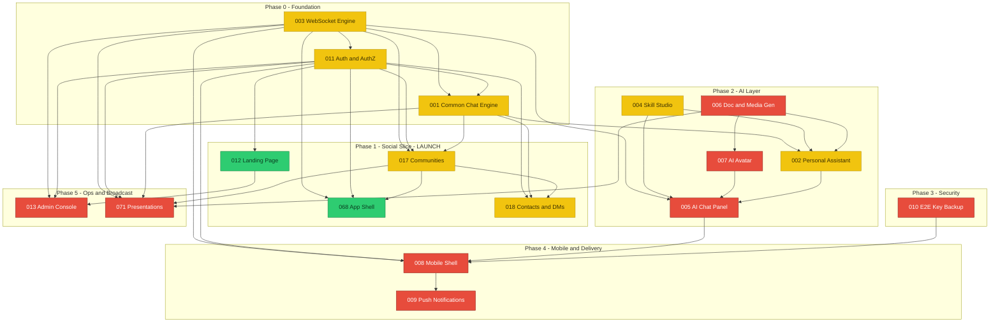

# YappChat — Development Plan

**Last Updated:** 2026-07-01 · **Phase:** Implementation · **Snapshot date:** 2026-07-01 dashboard

> **This file is the editable source of truth.** Change any step below, then run
> `pnpm devplan:pdf` (or `node scripts/build-devplan-pdf.mjs`) to regenerate
> `specs/DEVELOPMENT-PLAN.pdf`. Flip a step's status by changing its marker:
> `[ ]` → not started · `[~]` → in progress · `[x]` → done.
> The live, always-current status lives in the memory dashboard — this is a planning snapshot.

---

## ▶ START HERE

- **Where I am:** Phase 1 — shipping the social slice (auth + communities + chat). Foundation (Phase 0) is mostly built. `apps/web` is now **committed** to git; 018 Contacts & DMs is scoped and its safe-fix delta is built.
- **What's deployed:** Only the WS engine (ws.wxperts.com). `apps/web` is **not deployed yet** — deploying the Next app for the first time is the real Phase 1 exit gate.
- **Single next action:** decide 017 launch-scope (ship-as-is vs add discovery/native-messaging), then **deploy the slice** (app domain, prod secrets, matching `WS_INTERNAL_SECRET`). A live 2-account e2e of 018 (connect→accept→DM→group→invite→freeze→unfreeze) is deferred but wanted before/at deploy.
- **Nearest blocker:** the **app deploy** itself (nothing is scope-blocked now). Presentation (071, Phase 5) is intended to come *after* the slice is online.

---

## Status at a glance

| Spec | Title | State | Remaining (high-level) |
|------|-------|-------|------------------------|
| 003 | WebSocket Engine | 🟡 ~88% | Capacity monitoring + RedisBroker (horizontal scale). |
| 011 | Auth & Authorization | 🟡 ~80% | Device sessions/agent tokens, AuthGate/account UI, SSO SOC-2 hardening done (06-30). Remaining: magic-link, Apple/GitHub SSO, `oauthproviderconfigs` table. |
| 001 | Common Chat Engine | 🟡 ~22% | 23 external plugins, video, E2E, history/search. |
| 002 | Personal Assistant | 🟡 ~40% | Monitoring loop, OAuth, subagents. Migrations 0003–0004 pending. |
| 004 | Agent & Skill Studio | 🟡 ~50% | Sandbox runner, metrics, Archie assistant. Migration 0002 pending. |
| 017 | Communities | 🟡 ~28% | Discovery, native messaging, translation, RAG. |
| 012 | Public Landing Page | 🟢 100% | Done & verified. |
| 068 | Authenticated App Shell | 🟢 100% | Done & verified live. |
| 005 | AI Chat (Panel) | 🔴 0% | Not started. |
| 006 | Document & Media Gen | 🔴 0% | Not started. |
| 007 | AI Avatar | 🔴 0% | Not started. |
| 008 | Mobile Shell & Packaging | 🔴 0% | Not started. |
| 009 | Push Notifications | 🔴 0% | Not started. |
| 010 | E2E Key Backup & Recovery | 🔴 0% | Not started. |
| 013 | Admin Console | 🔴 0% | Not started (scoped). |
| 018 | Contacts & Direct Messages | 🟡 ~65% | Scoped + safe-fix delta built & committed (07-01): contacts graph rework, invite hardening, flood guard, group tx, search RL, admin freeze surface. Remaining: live e2e; **deferred to delta+Legal** — block/unfriend, @mention→PM, escrow encryption, illegal-activity monitoring. |
| 071 | Presentation (LiveKit) | 🔴 0% | Not started (scoped). |

Legend: 🟢 built · 🟡 partial · 🔴 not started · ⚪ not scoped.

---

## Dependency map

How the specs depend on each other, grouped by build phase. Build foundation-up: an
arrow `A --> B` means **B needs A first**.



**Critical path — the specs that unblock the most:**
- **003 → everything realtime**, **011 → every authed surface**, **001 → every message.** These three are the bedrock; keep them healthy first.
- **002 (PA) is the glue** — it consumes 004/006/007 and outputs into 005. Sequence that cluster together, not piecemeal.
- **008 (Mobile) has a 4-way gate** (001 + 003 + 010 + 011) — it cannot start until 010 exists.

---

## Phase 0 — Foundation (Identity · Transport · Message Bus)

*Bedrock everything imports. Mostly built — finish only what blocks later phases.*

- [~] **003 WebSocket Engine** — server/auth/broker/heartbeat/replay/presence/client-lib done. Remaining: capacity monitoring (70/90% alerts), RedisBroker (defer until >1 WS task).
- [~] **011 Auth** — core model, email/pw, refresh rotation, system flags, SSO/OIDC, org members done. Remaining: magic-link, device registry, AuthGate/account UIs.
- [~] **001 Chat Engine (core)** — tables + membership core + `/messaging` UI done & verified. Defer external plugins/video/E2E/search to their own phases.

**Exit gate:** auth + WS + `conversationmembers` core live-verified end-to-end. *(Largely met.)*

---

## Phase 1 — Social Slice (current launch focus)

*The slice going online first: people can sign in, join communities, and chat.*

- [x] **012 Landing Page** — done & verified.
- [x] **068 App Shell & Dashboard** — done & verified.
- [~] **017 Communities** — spaces + join/invite/moderation + FR-019 support-AI done. Remaining for launch-quality: discovery/directory, native messaging, presence/typing.
- [~] **018 Contacts & DMs** — scoped + **safe-fix delta built & committed (07-01):** contacts graph (immutable rows, derived-accepted, opposite-dir auto-accept, 24h decline purge), invite hardening (email-bound + verified + consume-first), flood guard (freeze + sysadmin unfreeze surface), group-chat tx, search rate-limit, engine-route + WS private-tier gates. Remaining: live 2-account e2e; heavy features (block/unfriend, @mention→PM, escrow, monitoring) **deferred to a delta revision + Legal**.
- [ ] **Launch ops:** commit `apps/web` ✅ → Design→Implementation lifecycle transition → deploy (app domain, prod secrets: `DATABASE_URL`, SES, Google SSO, `SITE_URL`, matching `WS_INTERNAL_SECRET`).

**Exit gate:** slice smoke-tested, committed, and deployed online.

---

## Phase 2 — AI Layer

*The differentiator: the Personal Assistant, its studio, its chat surface, its face.*
*Tightly interdependent — build as one cluster.*

- [~] **004 Skill Studio** — skill CRUD, schema editor, code-gen, agent templates done. Remaining: sandbox runner, metrics, Archie.
- [~] **002 Personal Assistant** — provider registry, sessions/SSE, skill-invocation runtime done. Remaining: PA channel/avatar, monitoring loop, calendar/email OAuth, subagents. *(Apply pending migrations 0003–0004.)*
- [ ] **006 Document & Media Generation** — job queue, PDF/Excel/PPTX, image gen, templates.
- [ ] **007 AI Avatar** — avatar library, `avatarconfigs`, animated state machine driven by `pa.status`.
- [ ] **005 AI Chat Panel** — slide-in panel: streaming SSE, rich content, voice, attachments, studio handoff.

**Exit gate:** PA answers in-chat (005) with a live avatar (007) and can generate a document (006).

---

## Phase 3 — Security & Compliance

- [ ] **010 E2E Key Backup & Recovery** — Argon2id + XChaCha20-Poly1305 backup, 24-word recovery codes, QR cross-device pairing, group session-key recovery. Server never sees plaintext.

**Exit gate:** key-recovery flow round-trips on a fresh device without the server seeing plaintext.

---

## Phase 4 — Mobile & Delivery

*Gated: 008 needs 001 + 003 + 010 + 011; 009 needs 008.*

- [ ] **008 Mobile Shell & Packaging** — Expo + EAS, mount the React app, `SecureKeyStore`, native video, deep linking.
- [ ] **009 Push Notifications** — APNs/FCM/Web Push fanout, silent-push-then-fetch for E2E, quiet hours, deep-link tap targets.

**Exit gate:** app installs on a device and receives a push.

---

## Phase 5 — Operations & Broadcast

- [ ] **013 Admin Console** — staff control plane at `/admin`: access gate, feedback inbox, health dashboard, audit-log viewer, role management, cross-spec config.
- [ ] **071 Presentations (Webinars)** — LiveKit screen-share + narration, GROQ live captions/translation, hand-raise, access-scoped replay, 100-attendee cap.

**Exit gate:** staff console live; a webinar can be hosted end-to-end.

---

## How to regenerate the PDF

```bash
pnpm devplan:pdf          # or: node scripts/build-devplan-pdf.mjs
```

Writes `specs/DEVELOPMENT-PLAN.pdf` with the diagram rendered as a real graphic.
Edit any step above first — the PDF always reflects the current markdown. The script
is offline (mermaid is injected from `node_modules`, no network needed).
